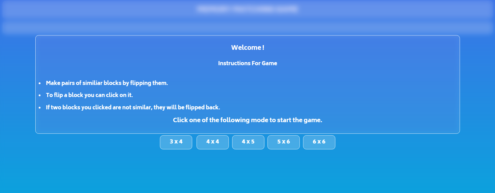
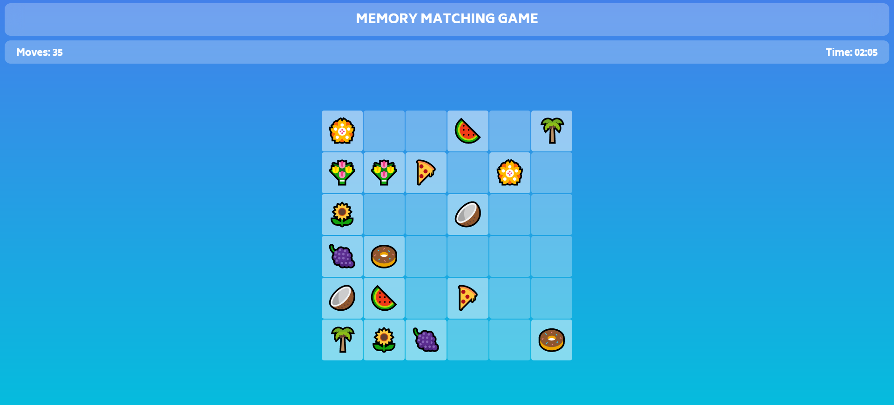

# Memory-Maching-Game
Test your memory skills with this fun and interactive game! Flip the cards to find matching pairs, challenge yourself to complete the game in the fewest moves, and track your best scores. Great for sharpening focus and improving concentration. Perfect for kids and adults alike!

## <b> [Click here to Play the GAME!!](https://devansh222004.github.io/Memory-Maching-Game/)

This project is made using HTML,CSS &amp; JavaScript.

It's a simple online memory matching game, which contains various levels.
 
Here are some snapshots from game.

  
